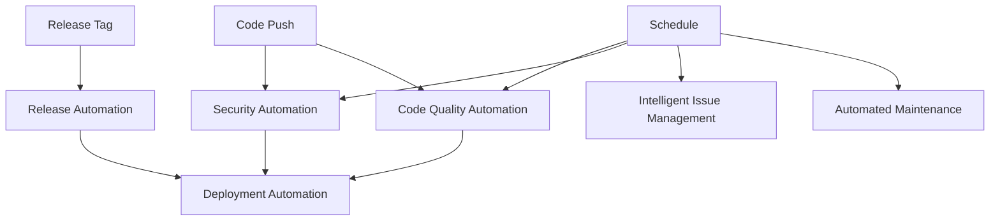

# GitHub Actions Automation Setup

This repository includes a comprehensive set of GitHub Actions workflows to automate various development and operational tasks. These workflows help maintain code quality, security, and streamline the development process.

## 📋 Available Workflows

### 1. **Automated Maintenance** (`automated-maintenance.yml`)

- **Trigger**: Daily at 2 AM UTC, manual dispatch
- **Purpose**: Keeps the workspace clean and organized
- **Features**:
  - Removes temporary files and caches
  - Checks for outdated packages
  - Identifies large files
  - Updates repository documentation
  - Generates workspace status reports

### 2. **Intelligent Issue Management** (`intelligent-issue-management.yml`)

- **Trigger**: New issues, every 4 hours, manual dispatch
- **Purpose**: Automates issue labeling and lifecycle management
- **Features**:
  - Auto-labels issues based on content
  - Marks inactive issues as stale
  - Closes old stale issues
  - Creates weekly issue summaries
  - Auto-assigns reviewers to PRs

### 3. **Security Automation** (`security-automation.yml`)

- **Trigger**: Daily at 1 AM UTC, push/PR to main/develop
- **Purpose**: Continuous security monitoring and compliance
- **Features**:
  - Dependency vulnerability scanning (Trivy, Safety, Bandit)
  - Secrets detection (TruffleHog, GitLeaks)
  - License compliance checking
  - Security policy validation
  - Automated security issue creation

### 4. **Code Quality Automation** (`code-quality-automation.yml`)

- **Trigger**: Push/PR, weekly on Sundays
- **Purpose**: Maintains code quality across all languages
- **Features**:
  - Multi-language code quality analysis (Python, C#, Java, JavaScript/TypeScript)
  - Test coverage reporting
  - Code metrics calculation
  - Code smell detection
  - Quality issue tracking

### 5. **Release Automation** (`release-automation.yml`)

- **Trigger**: Version tags, manual dispatch
- **Purpose**: Streamlines the release process
- **Features**:
  - Release validation and readiness checks
  - Multi-platform artifact building
  - Automated GitHub release creation
  - Package publishing (PyPI, NuGet, npm)
  - Post-release task tracking

### 6. **Deployment Automation** (`deployment-automation.yml`)

- **Trigger**: Push to main, releases, manual dispatch
- **Purpose**: Automates deployment to various environments
- **Features**:
  - Environment-specific deployments (dev/staging/production)
  - Docker image building and pushing
  - Azure and Kubernetes deployment support
  - Health checks and smoke tests
  - Deployment status tracking

## 🚀 Getting Started

### Prerequisites

1. **GitHub Repository Secrets**: Configure the following secrets in your repository settings:

   ```
   AZURE_CREDENTIALS     # For Azure deployments
   PYPI_API_TOKEN       # For Python package publishing
   NUGET_API_KEY        # For .NET package publishing
   NPM_TOKEN            # For npm package publishing
   ```

2. **Repository Settings**:
   - Enable Issues and Discussions
   - Configure branch protection rules for `main` branch
   - Set up GitHub Pages if using static site deployment

### Initial Setup

1. **Clone and Configure**:

   ```bash
   git clone <your-repo>
   cd <your-repo>

   # Make sure cleanup script is executable
   chmod +x cleanup-workspace.sh
   ```

2. **Configure Workflow Permissions**:

   - Go to Settings → Actions → General
   - Set "Workflow permissions" to "Read and write permissions"
   - Check "Allow GitHub Actions to create and approve pull requests"

3. **Customize Workflows**:
   - Update reviewer team names in `intelligent-issue-management.yml`
   - Adjust environment URLs in `deployment-automation.yml`
   - Modify quality thresholds in `code-quality-automation.yml`

## 🔧 Configuration

### Environment Variables

Each workflow can be customized through environment variables:

```yaml
# Example configuration in workflow file
env:
  PYTHON_VERSION: "3.11"
  NODE_VERSION: "18"
  DOTNET_VERSION: "8.0.x"
  JAVA_VERSION: "11"
```

### Workflow Labels

The workflows use the following labels (create them in your repository):

**Issue Management**:

- `bug`, `enhancement`, `documentation`, `security`, `performance`
- `python`, `dotnet`, `java`, `typescript`
- `priority:high`, `stale`, `automated`

**Deployment**:

- `deployment`, `development`, `staging`, `production`
- `success`, `failure`

**Quality & Security**:

- `code-quality`, `maintenance`, `security`, `compliance`
- `licenses`, `dependencies`

### Customizing Schedules

Modify the cron expressions to fit your needs:

```yaml
schedule:
  - cron: "0 2 * * *" # Daily at 2 AM UTC
  - cron: "0 */4 * * *" # Every 4 hours
  - cron: "0 3 * * 0" # Weekly on Sundays at 3 AM UTC
```

## 📊 Monitoring and Reporting

### Automated Reports

The workflows generate several automated reports:

1. **Weekly Issue Summary**: Created every Monday
2. **Security Scan Results**: Daily security vulnerability reports
3. **Code Quality Metrics**: Weekly code quality analysis
4. **Deployment Status**: Real-time deployment tracking

### Artifacts

Workflows store artifacts for:

- Code quality reports (30 days retention)
- Test coverage reports (30 days retention)
- Build artifacts (30 days retention)
- Security scan results (uploaded to GitHub Security tab)

## 🛠️ Troubleshooting

### Common Issues

1. **Workflow Permissions**:

   ```
   Error: Resource not accessible by integration
   ```

   **Solution**: Check workflow permissions in repository settings

2. **Missing Secrets**:

   ```
   Error: Secret AZURE_CREDENTIALS not found
   ```

   **Solution**: Add required secrets in repository settings

3. **Tool Installation Failures**:
   ```
   Error: pip install failed
   ```
   **Solution**: Check requirements.txt and tool versions

### Debugging

Enable debug logging by setting repository secrets:

```
ACTIONS_RUNNER_DEBUG=true
ACTIONS_STEP_DEBUG=true
```

### Manual Workflow Triggers

All workflows support manual triggering:

1. Go to Actions tab in your repository
2. Select the workflow you want to run
3. Click "Run workflow"
4. Configure any required inputs

## 🔄 Workflow Dependencies

Understanding workflow relationships:



## 📈 Best Practices

### Development Workflow

1. **Feature Development**:

   - Create feature branch
   - Code quality checks run on PR
   - Security scans validate changes
   - Merge triggers deployment to development

2. **Release Process**:

   - Create release tag
   - Automated build and validation
   - Deploy to staging for testing
   - Deploy to production after approval

3. **Maintenance**:
   - Daily automated cleanup
   - Weekly quality reports
   - Continuous security monitoring

### Performance Optimization

- Use workflow concurrency limits for resource management
- Cache dependencies where possible
- Use matrix builds for parallel execution
- Skip unnecessary workflows with path filters

## 🤝 Contributing

To add new automation workflows:

1. Create workflow file in `.github/workflows/`
2. Follow existing naming convention
3. Include proper documentation
4. Add appropriate triggers and permissions
5. Test with manual dispatch before enabling schedules

## 📚 Additional Resources

- [GitHub Actions Documentation](https://docs.github.com/en/actions)
- [Workflow Syntax Reference](https://docs.github.com/en/actions/reference/workflow-syntax-for-github-actions)
- [Security Best Practices](https://docs.github.com/en/actions/security-guides)
- [Azure Best Practices](https://docs.microsoft.com/en-us/azure/architecture/best-practices/)

---

_Last updated: $(date)_
_This setup provides enterprise-grade automation for software development workflows._


---

## 👨‍💻 Author & Attribution

**Created by Bryan Roe**  
Copyright (c) 2025 Bryan Roe  
Licensed under the MIT License

This is part of the Semantic Kernel - Advanced AI Development Framework.
For more information, see the main project repository.
