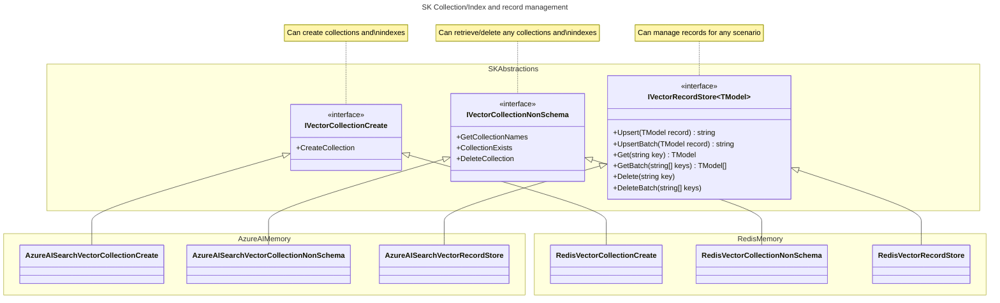

consulted: stephentoub, dluc, ajcvickers, roji
contact: westey-m
date: 2024-06-05T00:00:00Z
deciders: sergeymenshykh, markwallace, rbarreto, dmytrostruk, westey-m, matthewbolanos, eavanvalkenburg
informed: null
status: proposed

# Updated Memory Connector Design

## Context and Problem Statement

Semantic Kernel has a collection of connectors to popular Vector databases e.g. Azure AI Search, Chroma, Milvus, ...
Each Memory connector implements a memory abstraction defined by Semantic Kernel and allows developers to easily integrate Vector databases into their applications.
The current abstractions are experimental and the purpose of this ADR is to progress the design of the abstractions so that they can graduate to non-experimental status.

### Problems with current design

1. The `IMemoryStore` interface has four responsibilities with different cardinalities. Some are schema aware and others schema agnostic.
2. The `IMemoryStore` interface only supports a fixed schema for data storage, retrieval, and search, which limits its usability by customers with existing data sets.
3. The `IMemoryStore` implementations are opinionated around key encoding/decoding and collection name sanitization, which limits its usability by customers with existing data sets.

### Responsibilities:

| Functional Area | Cardinality | Significance to Semantic Kernel |
| --------------- | ----------- | ------------------------------- |
| Collection/Index create | An implementation per store type and model | Valuable when building a store and adding data |
| Collection/Index list names, exists and delete | An implementation per store type | Valuable when building a store and adding data |
| Data Storage and Retrieval | An implementation per store type | Valuable when building a store and adding data |
| Vector Search | An implementation per store type, model and search type | Valuable for many scenarios including RAG, finding contradictory facts based on user input, finding similar memories to merge |

### Memory Store Today

```cs
interface IMemoryStore
{
    // Collection / Index Management
    Task CreateCollectionAsync(string collectionName, CancellationToken cancellationToken = default);
    IAsyncEnumerable<string> GetCollectionsAsync(CancellationToken cancellationToken = default);
    Task<bool> DoesCollectionExistAsync(string collectionName, CancellationToken cancellationToken = default);
    Task DeleteCollectionAsync(string collectionName, CancellationToken cancellationToken = default);

    // Data Storage and Retrieval
    Task<string> UpsertAsync(string collectionName, MemoryRecord record, CancellationToken cancellationToken = default);
    IAsyncEnumerable<string> UpsertBatchAsync(string collectionName, IEnumerable<MemoryRecord> records, CancellationToken cancellationToken = default);
    Task<MemoryRecord?> GetAsync(string collectionName, string key, bool withEmbedding = false, CancellationToken cancellationToken = default);
    IAsyncEnumerable<MemoryRecord> GetBatchAsync(string collectionName, IEnumerable<string> keys, bool withVectors = false, CancellationToken cancellationToken = default);
    Task RemoveAsync(string collectionName, string key, CancellationToken cancellationToken = default);
    Task RemoveBatchAsync(string collectionName, IEnumerable<string> keys, CancellationToken cancellationToken = default);

    // Vector Search
    IAsyncEnumerable<(MemoryRecord, double)> GetNearestMatchesAsync(
        string collectionName,
        ReadOnlyMemory<float> embedding,
        int limit,
        double minRelevanceScore = 0.0,
        bool withVectors = false,
        CancellationToken cancellationToken = default);

    Task<(MemoryRecord, double)?> GetNearestMatchAsync(
        string collectionName,
        ReadOnlyMemory<float> embedding,
        double minRelevanceScore = 0.0,
        bool withEmbedding = false,
        CancellationToken cancellationToken = default);
}
```

### Actions

1. The `IMemoryStore` should be split into different interfaces, so that schema aware and schema agnostic operations are separated.
2. The **Data Storage and Retrieval** and **Vector Search** areas should allow typed access to data and support any schema that is currently available in the customer's data store.
3. The collection/index create functionality should allow developers to use a common definition that is part of the abstraction to create collections.
4. The collection/index list/exists/delete functionality should allow management of any collection regardless of schema.
5. Remove opinionated behaviors from connectors. The opinionated behavior limits the ability of these connectors to be used with pre-existing vector databases. As far as possible these behaviors should be removed.

### Non-functional requirements for new connectors

1. Ensure all connectors are throwing the same exceptions consistently with data about the request made provided in a consistent manner.
2. Add consistent telemetry for all connectors.
3. As far as possible integration tests should be runnable on build server.

### New Designs

The separation between collection/index management and record management.



### Vector Store Cross Store support - General Features

A comparison of the different ways in which stores implement storage capabilities to help drive decisions:

| Feature | Azure AI Search | Weaviate | Redis | Chroma | FAISS | Pinecone | LLamaIndex | PostgreSql | Qdrant | Milvus |
| ------- | --------------- | -------- | ----- | ------ | ----- | -------- | ---------- | ---------- | ------ | ------ |
| Get Item Support | Y | Y | Y | Y | | Y | | Y | Y | Y |
| Batch Operation Support | Y | Y | Y | Y | | Y | | | | Y |
| Per Item Results for Batch Operations | Y | Y | Y | N | | N | | | | |
| Keys of upserted records | Y | Y | N<sup>3</sup> | N<sup>3</sup> | | N<sup>3</sup> | | | | Y |
| Keys of removed records | Y | | N<sup>3</sup> | N | | N | | | N<sup>3</sup> |
| Retrieval field selection for gets | Y | | Y<sup>4</sup> | P<sup>2</sup> | | N | | Y | Y | Y |
| Include/Exclude Embeddings for gets | P<sup>1</sup> | Y | Y<sup>4,1</sup> | Y | | N | | P<sup>1</sup> | Y | N |
| Failure reasons when batch partially fails | Y | Y | Y | N | | N | | | |
| Is Key separate from data | N | Y | Y | Y | | Y | | N | Y | N |
| Can Generate Ids | N | Y | N | N | | Y | | Y | N | Y |
| Can Generate Embedding | Not Available Via API yet | Y | N | Client Side Abstraction | | | | | N | |

Footnotes:

- P = Partial Support
- <sup>1</sup> Only if you have the schema, to select the appropriate fields.
- <sup>2</sup> Supports broad categories of fields only.
- <sup>3</sup> Id is required in request, so can be returned if needed.
- <sup>4</sup> No strong typed support when specifying field list.

### Vector Store Cross Store support - Fields, types and indexing

| Feature | Azure AI Search | Weaviate | Redis | Chroma | FAISS | Pinecone | LLamaIndex | PostgreSql | Qdrant | Milvus |
| ------- | --------------- | -------- | ----- | ------ | ----- | -------- | ---------- | ---------- | ------ | ------ |
| Field Differentiation | Fields | Key, Props, Vectors | Key, Fields | Key, Document, Metadata, Vector | | Key, Metadata, SparseValues, Vector | | Fields | Key, Props(Payload), Vectors | Fields |
| Multiple Vector per record support | Y | Y | Y | N | | [N](https://docs.pinecone.io/guides/data/upsert-data#upsert-records-with-metadata) | | Y | Y | Y |
| Index to Collection | 1 to 1 | 1 to 1 | 1 to many | 1 to 1 | - | 1 to 1 | - | 1 to 1 | 1 to 1 | 1 to 1 |
| Id Type | String | UUID | string with collection name prefix | string | | string | UUID | 64Bit Int / UUID / ULID | 64Bit Unsigned Int / UUID | Int64 / varchar |
| Supported Vector Types | [Collection(Edm.Byte) / Collection(Edm.Single) / Collection(Edm.Half) / Collection(Edm.Int16) / Collection(Edm.SByte)](https://learn.microsoft.com/en-us/rest/api/searchservice/vector-search-api#vector-types) | [Collection(Edm.Byte) / Collection(Edm.Single) / Collection(Edm.Half) / Collection(Edm.Int16) / Collection(Edm.SByte)](https://learn.microsoft.com/en-us/rest/api/searchservice/vector-search-api#vector-types) | [Collection(Edm.Byte) / Collection(Edm.Single) / Collection(Edm.Half) / Collection(Edm.Int16) / Collection(Edm.SByte)](https://learn.microsoft.com/en-us/rest/api/searchservice/vector-search-api#vector-types) | [Collection(Edm.Byte) / Collection(Edm.Single) / Collection(Edm.Half) / Collection(Edm.Int16) / Collection(Edm.SByte)](https://learn.microsoft.com/en-us/rest/api/searchservice/vector-search-api#vector-types) | | [Collection(Edm.Byte) / Collection(Edm.Single) / Collection(Edm.Half) / Collection(Edm.Int16) / Collection(Edm.SByte)](https://learn.microsoft.com/en-us/rest/api/searchservice/vector-search-api#vector-types) | | [Collection(Edm.Byte) / Collection(Edm.Single) / Collection(Edm.Half) / Collection(Edm.Int16) / Collection(Edm.SByte)](https://learn.microsoft.com/en-us/rest/api/searchservice/vector-search-api#vector-types) | [Collection(Edm.Byte) / Collection(Edm.Single) / Collection(Edm.Half) / Collection(Edm.Int16) / Collection(Edm.SByte)](https://learn.microsoft.com/en-us/rest/api/searchservice/vector-search-api#vector-types) | [Collection(Edm.Byte) / Collection(Edm.Single) / Collection(Edm.Half) / Collection(Edm.Int16) / Collection(Edm.SByte)](https://learn.microsoft.com/en-us/rest/api/searchservice/vector-search-api#vector-types) |
| Supported Distance Functions | [Cosine / dot prod / euclidean dist (l2 norm)](https://learn.microsoft.com/en-us/azure/search/vector-search-ranking#similarity-metrics-used-to-measure-nearness) | [Cosine / dot prod / euclidean dist (l2 norm)](https://learn.microsoft.com/en-us/azure/search/vector-search-ranking#similarity-metrics-used-to-measure-nearness) | [Cosine / dot prod / euclidean dist (l2 norm)](https://learn.microsoft.com/en-us/azure/search/vector-search-ranking#similarity-metrics-used-to-measure-nearness) | [Cosine / dot prod / euclidean dist (l2 norm)](https://learn.microsoft.com/en-us/azure/search/vector-search-ranking#similarity-metrics-used-to-measure-nearness) | | [Cosine / dot prod / euclidean dist (l2 norm)](https://learn.microsoft.com/en-us/azure/search/vector-search-ranking#similarity-metrics-used-to-measure-nearness) | | [Cosine / dot prod / euclidean dist (l2 norm)](https://learn.microsoft.com/en-us/azure/search/vector-search-ranking#similarity-metrics-used-to-measure-nearness) | [Cosine / dot prod / euclidean dist (l2 norm)](https://learn.microsoft.com/en-us/azure/search/vector-search-ranking#similarity-metrics-used-to-measure-nearness) | [Cosine / dot prod / euclidean dist (l2 norm)](https://learn.microsoft.com/en-us/azure/search/vector-search-ranking#similarity-metrics-used-to-measure-nearness) |
| Supported index types | [Exhaustive KNN (FLAT) / HNSW](https://learn.microsoft.com/en-us/azure/search/vector-search-ranking#algorithms-used-in-vector-search) | [HNSW / Flat / Dynamic](https://weaviate.io/developers/weaviate/search/vector-search#algorithms-used-in-vector-search) | [Exhaustive KNN (FLAT) / HNSW](https://learn.microsoft.com/en-us/azure/search/vector-search-ranking#algorithms-used-in-vector-search) | [Exhaustive KNN (FLAT) / HNSW](https://learn.microsoft.com/en-us/azure/search/vector-search-ranking#algorithms-used-in-vector-search) | - | [Exhaustive KNN (FLAT) / HNSW](https://learn.microsoft.com/en-us/azure/search/vector-search-ranking#algorithms-used-in-vector-search) | - | [Exhaustive KNN (FLAT) / HNSW](https://learn.microsoft.com/en-us/azure/search/vector-search-ranking#algorithms-used-in-vector-search) | [Exhaustive KNN (FLAT) / HNSW](https://learn.microsoft.com/en-us/azure/search/vector-search-ranking#algorithms-used-in-vector-search) | [Exhaustive KNN (FLAT) / HNSW](https://learn.microsoft.com/en-us/azure/search/vector-search-ranking#algorithms-used-in-vector-search) |

### Vector Store Cross Store support - Search and filtering

| Feature | Azure AI Search | Weaviate | Redis | Chroma | FAISS | Pinecone | LLamaIndex | PostgreSql | Qdrant | Milvus |
| ------- | --------------- | -------- | ----- | ------ | ----- | -------- | ---------- | ---------- | ------ | ------ |
| Index allows text search | Y | Y | Y | Y (On Metadata by default) | | [Only in combination with Vector](https://docs.pinecone.io/guides/data/understanding-hybrid-search) | | Y (with TSVECTOR field) | Y | Y |
| Text search query format | [Simple or Full Lucene](https://learn.microsoft.com/en-us/azure/search/search-query-create?tabs=portal-text-query#choose-a-query-type-simple--full) | [wildcard](https://weaviate.io/developers/weaviate/search/similarity) | [Simple or Full Lucene](https://learn.microsoft.com/en-us/azure/search/search-query-create?tabs=portal-text-query#choose-a-query-type-simple--full) | [Simple or Full Lucene](https://learn.microsoft.com/en-us/azure/search/search-query-create?tabs=portal-text-query#choose-a-query-type-simple--full) | | [Simple or Full Lucene](https://learn.microsoft.com/en-us/azure/search/search-query-create?tabs=portal-text-query#choose-a-query-type-simple--full) | | [Simple or Full Lucene](https://learn.microsoft.com/en-us/azure/search/search-query-create?tabs=portal-text-query#choose-a-query-type-simple--full) | [Simple or Full Lucene](https://learn.microsoft.com/en-us/azure/search/search-query-create?tabs=portal-text-query#choose-a-query-type-simple--full) | [Simple or Full Lucene](https://learn.microsoft.com/en-us/azure/search/search-query-create?tabs=portal-text-query#choose-a-query-type-simple--full) |
| Multi Field Vector Search Support | Y | [N](https://weaviate.io/developers/weaviate/search/similarity) | [Y](https://redis.io/docs/latest/develop/interact/search-and-indexing) | N (no multi vector support) | | N | | [Unclear due to order by syntax](https://github.com/pgvector/pgvector) | N (no multi vector support) | [Y](https://milvus.io/docs/multi-vector-search.md#Step-1-Create-Multiple-AnnSearchRequest-Instances) |
| Targeted Multi Field Text Search Support | Y | [Y](https://weaviate.io/developers/weaviate/search/hybrid#set-weights-on-property-values) | Y | [Y](https://docs.trychroma.com/guides#using-log

